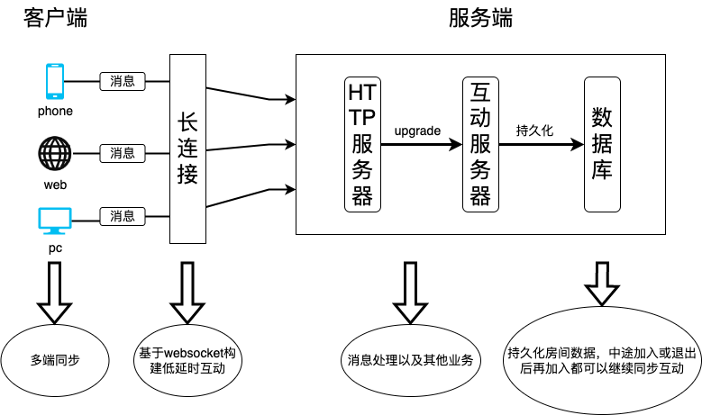
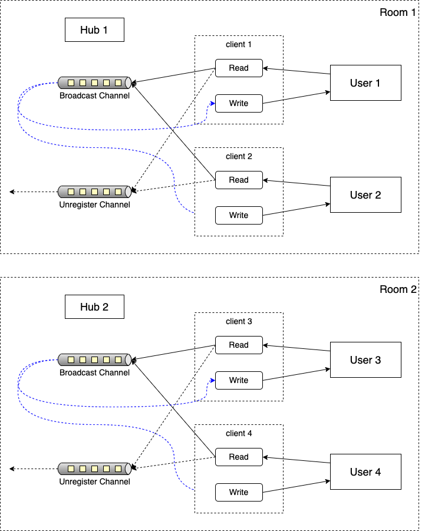
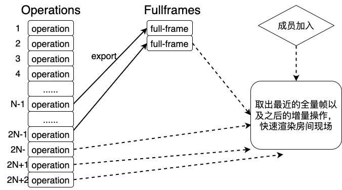

# 架构设计

## 总体架构

## 互动架构

每个房间维护一个hub，其中包含广播消息通道和退出通道。用户建立连接时新建一个client并循环读取用户发来的消息写入hub的广播通道，广播通道广播时写回给用户。当用户退出房间时，将该用户的client从房间的客户端列表中移除。

## 恢复现场

房间内每n次操作保存一次当前画板的全量帧，当用户中途加入或者退出后再加入时，可以获取最近的全量帧和少量增量帧恢复现场，不用从头恢复一遍。

